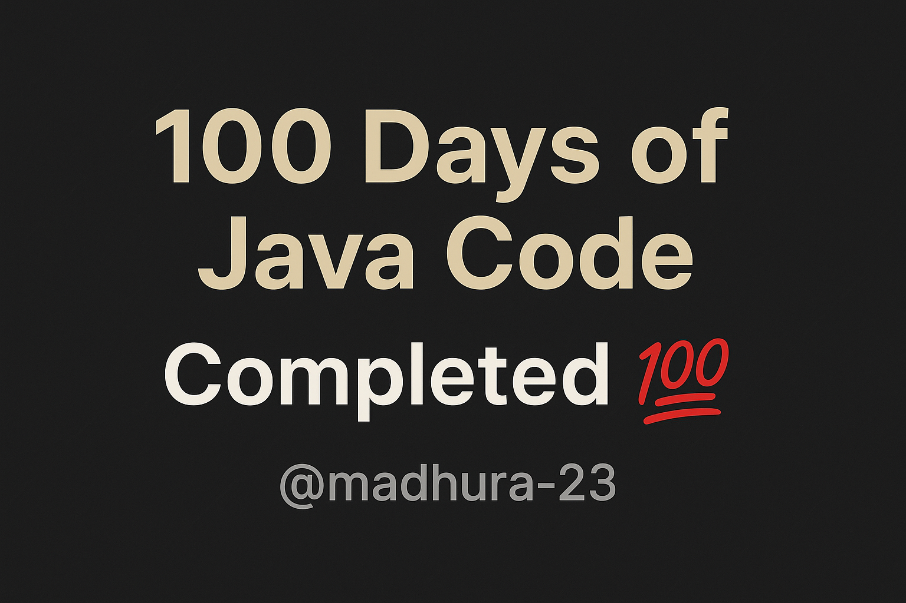

# 💯 100 Days of Java Code — Completed 🚀

I successfully completed my **#100DaysOfCode** challenge focused entirely on **Java programming** — from fundamentals to advanced problem-solving.  
This repository is a reflection of my consistency, growth, and the passion I’ve built for coding over these 100 days. ☕💻

---

## 🗓️ Challenge Duration
**Start Date:** July 18, 2025  
**End Date:** October 24, 2025  

100 days of learning, coding, debugging, building, and leveling up every single day 🌱

---

## 🧠 What I Covered

### 🔹 Core Java
- Variables, Data Types, Operators  
- Control Statements (if-else, switch, loops)  
- Functions, Recursion, and OOP Concepts  
- Exception Handling and File I/O  
- Collections Framework (List, Set, Map)  

### 🔹 DSA in Java
- Arrays, Strings, Linked Lists, Stacks, Queues  
- Searching and Sorting Algorithms  
- Recursion & Backtracking  
- Hashing, Trees, Binary Search Trees  
- Graphs and Dynamic Programming  
- Solved 200+ LeetCode and platform-based problems  

### 🔹 Mini Projects
- ✅ Java-based To-Do App  
- ✅ Library Management CLI App  
- ✅ DSA Practice Tracker  
- ✅ Pattern Generator & Number Solver  
- ✅ Random Fun Codes Repository (Logical Experiments)

---

## 🎯 Key Takeaways
- Wrote **Java code every single day** — no breaks, no excuses.  
- Strengthened **logical thinking and problem-solving skills**.  
- Built a habit of **consistent learning and clean coding**.  
- Gained deeper understanding of **data structures and algorithms**.  
- Boosted confidence in tackling real-world coding challenges.

---

## 📈 Progress in Numbers
| Category | Count |
|-----------|--------|
| Coding Days | 100 |
| Java Programs | 150+ |
| DSA Problems | 200+ |
| Mini Projects | 5+ |
| Bugs Fixed | countless 🐛😄 |

---

## 💡 Reflections
> “100 days ago, I started with curiosity.  
> Now, I end with clarity, confidence, and code that speaks for itself.” 💫  

This challenge taught me the value of **discipline over motivation**, and how even small steps every day lead to massive progress.

---

## 🌟 What’s Next
- Continue solving advanced DSA problems in Java.  
- Build 3 major projects using **Java + Spring Boot + AWS**.  

---

## 🧩 Repository Structure
📁 100-days-code/
┣ 📂 Day1-Day30 → Core Java & Basics
┣ 📂 Day31-Day60 → DSA Foundations
┣ 📂 Day61-Day90 → Advanced DSA & OOP Projects
┣ 📂 Day91-Day100 → Final Projects & Notes
┗ 📄 README.md → (You’re here!)

---

## 💬 Closing Note
Thank you for visiting this repo! 🌸  
If you’re starting your own **100 Days of Code**, trust the process — your future self will thank you.  

> “Code. Debug. Learn. Repeat.” ☕💻  
⭐ *Star this repo if my journey inspired you to start yours!*  

---
Lets connect and make this work more memorable.
### 👩‍💻 Author: [@madhura-23](https://github.com/madhura-23)

Started the python 100 days series are well do check it!
